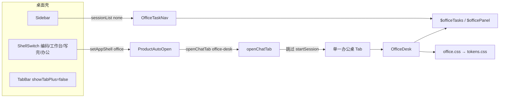
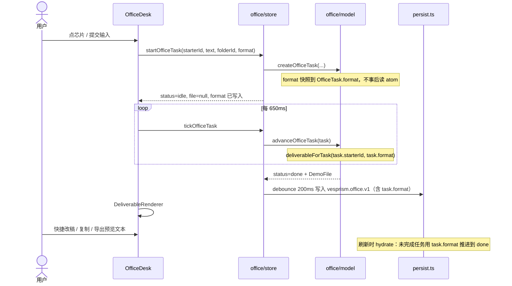
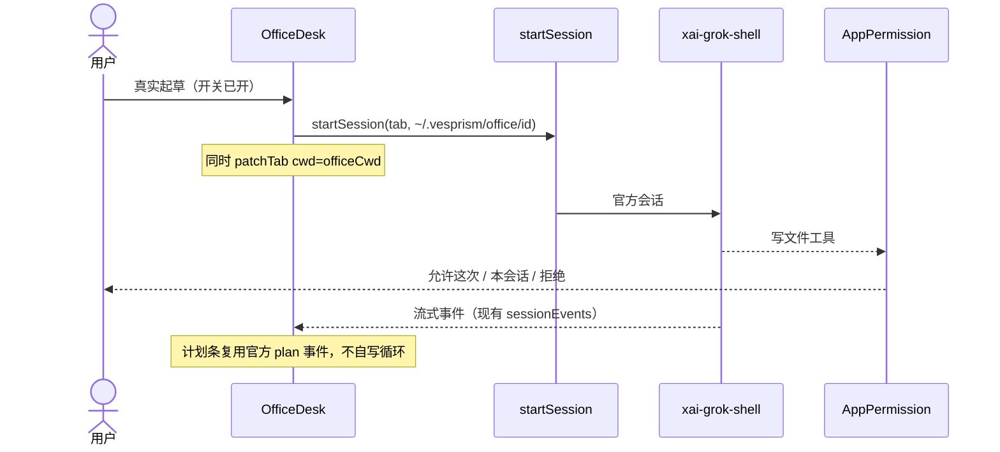

# Vesprism 办公桌（office-desk）产品与工程规格

| 项 | 值 |
|---|---|
| 状态 | Draft |
| 日期 | 2026-09-01 |
| 作者 | Vesprism 桌面端 |
| 受众 | Vesprism 桌面端工程师 |
| 取代 | [`docs/superpowers/specs/2026-08-31-office-desk-design.md`](docs/superpowers/specs/2026-08-31-office-desk-design.md)（交互原则仍有效；UI 分区、配色、空态已过时，勿照抄） |
| 代码根 | `crates/vesprism-desktop/src/office/` |
| 已落地提交 | `c2533519`「功能(桌面端)：办公第四产品 demo，抽出侧栏与输入框」 |
| 远端 | `origin` = `https://github.com/wang1021-learner/vesprism.git`（永不 push `upstream`） |

本文是办公产品的现行规格：写清**已经上线的是什么**、**视觉与产品硬规则**、以及**下一增量**（不接引擎、不重写官方 Grok Build）。正式接引擎、真 Office 导出、本机材料夹授权，全部放在带门闩的后续 PR，不塞进下一刀。

下一增量拆成两刀，避免 CSS 回滚带走 persist：

- **PR-1a**：抽文件 + `localStorage` 落盘 + 演示诚实化（无首页改版）。
- **PR-1b**：工作优先首页（材料夹主舞台、输入沉底、七枚芯片）。CSS 走 gstack 三技能。

---

## Overview

办公是 Vesprism 桌面工作台的第四套产品，和编码 / 工作台 / 写完并列，入口在侧栏左上角 `ShellSwitch`。用户的活是**对着材料夹交稿**（周报、汇报幻灯片、合同要点），不是开一个引擎会话闲聊，也不是飞书/钉钉，更不是电脑操作。

第一期已经作为交稿 demo 落地（学 Cowork 的「材料夹 → 计划 → 产物」，不学英雄空态与暖色）：产品 id `office`，面板 `utilityKind: 'office-desk'`，切过来自动打开专用 Tab，**不** `startSession`，侧栏列任务不列引擎会话。主区用预置四步计划 + 假产物预览模拟交稿。配色已收回 Vesprism 冷纸（`tokens.css`：画布 `#f3f4f6`、纸面白、墨 `#1c1c1e`），不再用 Claude 暖橙或脏米色。

当前最大产品缺口不是「再做一个 Agent 循环」，而是**第一眼仍像空聊天英雄页**（居中输入框 + 七张场景胶囊），以及演示文案把假 `.docx` / 「已授权飞书」当成真的。PR-1a 先把落盘和诚实化做完；PR-1b 把首页改成**材料夹和工作稿当主舞台、输入沉底**。引擎、真 OOXML、本机选夹，全部后置。

---

## Background & Motivation

### 四套产品里办公站在哪

`PRODUCTS` 登记在 [`crates/vesprism-desktop/src/products/catalog.ts`](crates/vesprism-desktop/src/products/catalog.ts)。壳切换、侧栏入口、首页、Tab 过滤都查这张表，不要再给 `AppShell` 加联合成员。

| 产品 | 用户在干什么 | 侧栏列什么 | 引擎会话 |
|---|---|---|---|
| 编码 | 对着 Git 仓库改代码 | 项目 / 会话 | `startSession`，cwd = 仓库 |
| 工作台 | 对话生成流程与岗位 | 干活会话（绑过产物的） | 画布/编制会开会话 |
| 写完 | 按章把长篇写完 | 书库 | Tab 创建跳过；打开一本书才 `startSession`，cwd = `~/.vesprism/writing/<id>`，锁 `ask` |
| **办公** | 对着材料夹交稿 | **任务** | **全程不开会话（demo）** |

README 一句话：*「办公对着材料夹交稿（demo）」*。手册 [`docs/Vesprism-全功能与实现手册.md`](docs/Vesprism-全功能与实现手册.md) §17 明确写了边界：*办公桌是 demo：预置计划与产物，不 startSession、不接引擎、不操作电脑。* 手册更早的 `openChatTab` 句（「`skipSession` 或 kind===`flow-run` 都不 startSession」）**漏了** `writing-desk` / `office-desk`；以 `openChatTab.ts` 和 §17 为准。PR-1a 改那一句。

### 为什么单独成产品

1. **不能抢编码 cwd。** 办公材料夹不是 Git 仓库。若走编码的 `startSession(tabId, cwd)`，会把当前仓库拽进办公 Tab，或把办公目录登记成项目。写完已经用 `utilityKind !== 'writing-desk'` 跳过启动；办公抄同一条，见 `openChatTab.ts`。
2. **第一印象必须是稿，不是聊天。** Claude Cowork 的空态是居中英雄输入。Vesprism 的活是「本周材料 → 周报/幻灯片/合同」。用户打开办公，应先看见夹里的文件和上一份已完成的稿。
3. **不重写运行时。** 模型循环、工具、MCP、权限、计划模式都在官方 `xai-grok-shell`。办公 demo 只画壳；将来真起草也是「开官方会话 + 官方技能 / 已发布 sidecar」，前端不送 Rhai，不自写 Agent 环。

### 已过时的 08-31 规格（勿照抄）

[`docs/superpowers/specs/2026-08-31-office-desk-design.md`](docs/superpowers/specs/2026-08-31-office-desk-design.md) 仍对的部分：学 Cowork 交互不学配色；材料夹不是 Git；不做飞书/钉钉主路径；不做虚拟桌面；正式版才接引擎。

已过时、本文取代的部分：

| 08-31 | 现状 / 新规 |
|---|---|
| 左任务 / 中对话+计划 / 右进度与产物（三栏） | 干活态两栏：左计划与改稿 Dock，右交付物画板。产物是主角 |
| 「空态不是封面：问候 + 输入框内嵌…」 | PR-1b 删掉 `od-hello` 英雄标题；顶条是材料夹，不是「交一份稿」h1 |
| 「主区用画布灰、输入用白、胶囊带浅色」 | 已改为继承 `--bg-canvas` / `--surface` / `--cta`，禁止另起米色 |
| 侧栏技能/专家带演示徽章数字 | 徽章必须等于对应数组 `length`，禁止写死 `'12'` / `'8'` 这类假计数 |

### 痛点（相对已上线 demo）

- **空态是聊天，不是工作。** `OfficeDesk` 首页：`od-hello`「交一份稿」+ 居中 `od-box` + 五类 Tab + 七张 `od-capsule-card` + 推荐指令列表。材料夹只在输入框底下一枚徽章，点开才是 Modal。
- **刷新丢任务，未完成任务会卡住。** `$officeTasks` 是内存 atom。落盘后若原样恢复 `status:'running'`，`OfficeDesk` 的 `setTimeout` 不会自动续上，侧栏会永远「执行中」。
- **演示过满、不够诚实。** 连接器把飞书/钉钉标成 `connected`；`DemoFile.name` 是 `*.docx` 但 Blob 是 `text/plain`；`OFFICE_NAV` 技能徽章 `'12'` 而 `OFFICE_SKILLS.length === 8`；排程 `lastRun` 写「成功交付」到飞书；专家/连接器仍用 emoji。
- **选择器是死控件。** `$officeFormat` 写入 atom，但 `createOfficeTask` 不把 format 存进 `OfficeTask`，`advanceOfficeTask` 只调 `deliverableForTask(starterId)`。即使 start 时传入 format，tick / 刷新仍变回 Word。`OfficeFormat` 还含无渲染器的 `pdf`/`web`。
- **`OfficeDesk.tsx` 1121 行。** 首页、执行态、PPT/Excel/合同渲染、技能/专家/知识库/排程/连接器/历史全挤在一个文件。Windows 大小写不敏感，抽出时禁止在 `Sidebar.tsx` 旁建 `Sidebar/`。

---

## Goals & Non-Goals

### Goals（本规格覆盖的范围）

1. 把已上线 demo 写成可执行的产品/工程契约，避免下一刀把办公做成「第二个写完」或「套了皮的编码会话」。
2. 固定视觉：Vesprism 冷纸，gstack 设计技能，不另起设计系统。
3. **PR-1a**：抽文件 + 任务落盘（含 in-flight hydrate）+ 演示诚实化。仍不接引擎。
4. **PR-1b**：工作优先首页（线框见 §6）。仍不接引擎。
5. 给出带门闩的后续增量：本机材料夹只读挂载 → 接引擎起草 → 真 Office 导出。

### Non-Goals（明确不做）

- **不重写官方 Grok Build / `xai-grok-shell` / `grok-session`。** 工具循环、MCP、权限、模型选择留在官方运行时。
- **PR-1a / 1b 不 `startSession`。** 若要接引擎，必须单独 PR + 明确门闩（见 §7.2）。
- **不做飞书 / 钉钉 / 企业微信主路径。** 连接器页只展示「未接」，不能假装已授权。
- **不做电脑操作。** `[desktop] computer_use` 默认 `false`；办公不得打开它。
- **不做虚拟桌面、抢键鼠、云端 Dispatch。**
- **前端不编译 Rhai / 不往 `SaveFlowRequest` 塞脚本。** 流程编译留在 `src-tauri/src/workbench/flow_compile.rs`。
- **不改 Tab cwd 模型、不缩 `book-open` 组装 IPC、不拆 crate、不做 Isolation、不把产品改名为 `jike:`。** 用户没要这些。
- **不引入 shadcn / Inter / 紫渐变 / 通用 SaaS 套件。** 视觉只走 gstack：`design-consultation` / `design-shotgun` / `design-html`。PR-1b 的 CSS 必须过其中一趟，禁止手搓一套新色板。
- **Windows：禁止在 `components/Sidebar.tsx` 旁建 `Sidebar/` 目录。** 抽出已经放在 `lib/sidebarFormat.ts`、`lib/composerFormat.ts`、`components/sidebarIcons.tsx`、`components/sidebarChatRow.tsx`、`components/composerIcons.tsx`。办公新文件放 `src/office/` 或已有的 `office/chrome/`。

---

## Proposed Design

### 1. 已上线架构（契约，不是提案）



接线点（改办公时必须顺着走，不要另开通道）：

| 层 | 文件 | 行为 |
|---|---|---|
| 产品表 | `products/catalog.ts` `id: 'office'` | `utilityKinds: ['office-desk']`，`emptyView: 'panel'`，`autoOpenPanel: true`，`sessionList: 'none'`，`showTabPlus: false`，`showRightPanel: false`，`showNewChat: false`，`showAddProject: false` |
| 顶栏切换 | `components/ShellSwitch.tsx` | `listedProducts()` 第四项「办公」；`OfficeIcon` 公文包线框 |
| 切壳 | `store.ts` `setAppShell` | 记住每壳最后 Tab；办公没有已开 Tab 时落到 `AppMainBody` → `ProductAutoOpen` |
| 自动开面板 | `products/ProductHome.tsx` `ProductAutoOpen` | `useEffect` 调 `openChatTab({ title: '办公桌', utilityKind: 'office-desk' })` |
| 开 Tab | `lib/openChatTab.ts` | `utilityKind === 'office-desk'` 时**不** `startSession`（与 `writing-desk`、`flow-run` 并列） |
| 主区挂载 | `App.tsx` `AppMainBody` | `kind === 'office-desk'` → lazy `OfficeDesk`；**不**挂 `SessionAlertBanner` / `AppPermission` / `AppMcpElicit`（没有引擎事件） |
| 侧栏 | `components/Sidebar.tsx` | `usesEngineSessionList` 为 false 且 `product.id === 'office'` → `<OfficeTaskNav />`，否则写完书库 |
| 事件 | `lib/sessionEvents.ts` `session_id_changed` | 若将来有 session，`office-desk` 与 `writing-desk` 一样**不** `markToolSession`，避免被藏进工具会话 |
| 设置绑会话 | `store.ts` `findReadyCodingTabId`、`lib/codingSession.ts` | 只绑 `getProduct(...).isDefault` 的编码 Tab。办公 Tab 不是默认产品，设置里的 MCP/技能不会落到它上面 |
| 样式入口 | `index.css` | `@import './office/office.css'`，office 变量全部 `var(--bg-canvas)` 等，禁止硬编码米色 |

产品表原文（不要改这些字段，除非规格改了）：

```ts
{
  id: 'office',
  label: '办公',
  utilityKinds: ['office-desk'],
  emptyView: 'panel',
  showRightPanel: false,
  showNewChat: false,
  showTabPlus: false,
  showAddProject: false,
  sessionList: 'none',
  sessionGroupKey: '__office__',
  sidebarNavLabel: '办公入口',
  sidebarListLabel: '任务',
  emptyHint: '还没有办公任务。',
  autoOpenPanel: true,
  sidebarEntries: [{ kind: 'office-desk', label: '办公桌' }],
}
```

与写完的差异（有意为之，不是漏了）：

| | 写完 | 办公（demo） |
|---|---|---|
| `autoOpenPanel` | 未设 → `ProductLand` 空桌，用户点书再开 | `true` → 切过来就开办公桌 |
| `showTabPlus` | `true`（可并列多本写台） | `false`（一张桌子） |
| 侧栏 | 书库，Rust `writing_*` IPC | 任务导航，前端 atom |
| 引擎 | 打开书后 `startSession` + 锁 `ask` | 永不启动 |
| 权限条 | 主区挂了审批/提问条 | 不挂 |

`openChatTab` 跳过会话的硬编码：

```90:100:crates/vesprism-desktop/src/lib/openChatTab.ts
    if (
      !opts.skipSession &&
      utilityKind !== 'flow-run' &&
      utilityKind !== 'writing-desk' &&
      utilityKind !== 'office-desk'
    ) {
      await startSession(tabId, cwd, {
        modelId: model.modelId,
        reasoningEffort: model.reasoningEffort,
      })
    }
```

PR-1a 把同文件 JSDoc 改成一句：*`skipSession`：只开面板、不启引擎（试跑详情；写台稍后按书自己 `startSession`；办公桌 demo 永不 `startSession`）*。行为不变。

注意：Tab 创建仍会 `resolveNewTabCwd()` 写一个绝对 cwd（闲聊目录），只是不拿它开会话。**禁止**把这个 cwd 当成材料夹，也禁止 `registerAndSwitchWorkspace`。冷启动切到办公会走 `openTab()` IPC；跳过的是 `startSession`，不是 Tab IPC。

### 2. 模块地图（已落地）

```
src/office/
  index.tsx              lazy 出口：OfficeDesk
  OfficeDesk.tsx         首页 / 执行态 / CatalogPage / 渲染器（PR-1a 拆）
  catalog.ts             导航、胶囊、技能、专家、知识库、排程、连接器、格式、权限
  model.ts               起手、演示夹、四步计划、富产物、advanceOfficeTask
  store.ts               nanostores：任务、面板、权限、夹、格式
  office.css             冷纸映射 + 布局；禁止另起色板
  chrome/TaskNav.tsx     侧栏：OFFICE_NAV + 近期任务
  catalog.test.ts
  model.test.ts
```

壳侧已抽出、办公不要再复制一份：

- `lib/sidebarFormat.ts` — 时间标签 / cwd 显示名
- `lib/composerFormat.ts` — 工作区标签、token 缩写、平台判断（PR-0 一并抽出）
- `components/sidebarIcons.tsx` — `OfficeDeskIcon` 等线框
- `components/sidebarChatRow.tsx` — 编码会话行，办公不用
- `components/composerIcons.tsx` — 文件夹线框，不用系统 emoji

`UtilityKind` 已含 `'office-desk'`（`store.ts`）。`isWorkbenchUtility('office-desk') === true` 仍由 `store.tab-model.test.ts` 锁住；**设置绑会话的实际路径**是 `findReadyCodingTabId`（`getProduct(productIdForUtility(kind)).isDefault`），不是这个 helper。`findTabByUtilityKind('office-desk')` 复用唯一办公 Tab。

### 3. Demo 运行时（假引擎，真状态机）



关键函数：

- `createOfficeTask(starterId, prompt, id, folderId, format)`：**把 `format` 写进返回的 `OfficeTask.format`**（缺省 `'doc'`）。标题来自 `OFFICE_STARTERS` 或 `titleForCustom`（24 字截断）；`plan = planForTask(starterId)` 固定四步；`file = null`。预置 `starterId` 的产物仍按 starter 走，但字段仍要存，避免 custom 刷新丢种类。
- `startOfficeTask(starterId, prompt, folderId?, format?)`：若调用方传入 `format`（目录页），用它；**否则**（首页 composer）读 `$officeFormat.get()`。再交给 `createOfficeTask`。禁止 `advanceOfficeTask` / `deliverableForTask` 自己读 atom（`store.ts` 已 import `model.ts`，反向会循环）。
- `advanceOfficeTask(task)`：`idle → running` 逐步 +1；越过最后一步后 `status='done'`，`file = task.file ?? deliverableForTask(task.starterId, task.format)`。hydrate 走同一条纯函数，不需要全局 format。
- `applyRefinement`：字符串匹配「精简 / 英文 / 待办」，改 `preview` / `summary` / `name`。英文分支把文件名收成 `{stem}_EN.md`（见 §6.5）。**不是**模型调用。
- 节拍：`OfficeDesk` / `TaskView` 内 `STEP_MS = 650`，首步 240ms。整段约 2.8s。不要做成假打字机。

演示夹（**不是 Git 仓库**）：

```ts
DEMO_FOLDERS[0] = {
  id: 'week',
  name: '本周工作材料',
  files: [
    '销售周报底稿.md',
    '客户纪要-周四.txt',
    '竞品价格表.xlsx',
    '采购合同初稿-续约.docx',
    '季度经营快报.pdf',
  ],
}
```

第二夹 `project_alpha`（AI 办公专题调研）可留作切换演示。`OFFICE_FOLDERS` 的 `none` = 暂不关联。夹内文件目前只有名单/大小/日期，没有磁盘路径。材料夹文件名里的 `.docx` 表示「演示素材的种类」，不是导出产物；不要改演示夹名单。

七条起手与产物（`model.ts` `PLANS` / `FILES`）。PR-1a 把 `DemoFile.name` 改成 `.md`（见 §6.6 导出规则）：

| starterId | 产物 kind | 预览形态 | 落盘后 `file.name` |
|---|---|---|---|
| `weekly` | doc | 公文纸 + 待办表 | `第12周工作周报-华东区域.md` |
| `deck` | pptx | 8 页幻灯片 + 演讲备注 | `华东区域业务汇报与策略对策.md` |
| `contract` | doc | 风险卡（高/中/低）+ 意见书 | `续约服务合同法务审查意见书.md` |
| `excel_analysis` | xlsx | KPI 卡 + 对账表 | `竞品价格对比与毛利测算分析.md` |
| `meeting_minutes` | doc | 纪要 + Action Items | `周四华东业务复盘会纪要与待办.md` |
| `market_research` | xlsx | 竞品矩阵表 | `国内AI办公Agent竞品对照矩阵.md` |
| `doc_polish` | doc | 审校终稿 | `华东区域战略推进报告-审校修订终稿.md` |
| `custom` | 见格式表 | 空骨架或通用文稿 | `交付预览.md` |

### 4. 视觉规则（冷纸，gstack only）

单一色源：[`crates/vesprism-desktop/src/styles/tokens.css`](crates/vesprism-desktop/src/styles/tokens.css)。`office.css` 只做映射：

| 角色 | token | 值（light） |
|---|---|---|
| 画布 | `--bg-canvas` / `--od-bg` | `#f3f4f6` |
| 纸面 | `--surface` / `--od-surface` | `#ffffff` |
| 墨 | `--text-primary` / `--od-text` | `#1c1c1e` |
| 次要文字 | `--text-secondary` | `#636366` |
| CTA | `--cta` / `--od-cta` | `#1c1c1e`（深墨按钮，白字） |
| 成功/警告/危险 | `--success` / `--warning` / `--danger` | 仅状态点、风险等级、毛利红 |

禁止：

- Claude 暖橙 spark、脏米色、居中营销 billboard、大 emoji 装饰。
- 办公私有色板（`--od-*` 必须指向 token，不得写 `#f5f0e8` 这类）。
- Inter / shadcn / 紫渐变。字体跟 `:root`：Segoe UI / PingFang SC / Microsoft YaHei。代码预览用已内嵌的 JetBrains Mono。
- 视觉改动走 gstack 三技能；不要从 `~/.claude/skills` 拉 ui-design / frontend-design 等。

暗色：已有 `:root[data-theme='dark'] .od-desk` 把 `--od-on-cta` 收到画布色，避免深底深钮。新样式必须在 dark 下可扫读。

动效：全局 `--duration-*` 目前是 `0ms`。办公不要自己加 spinner 以外的动画；现有 `od-spin` 仅加载占位。

文案：短、可扫、无 happy talk。

- **首页不再有 h1「交一份稿」。** PR-1b 顶条是材料夹名 + 份数 +「演示」+「还不接引擎」。那句状态灰字只出现一次，在顶条，不当英雄副标题。
- README / README.zh 办公行把「Cowork 式任务台」改成「材料夹 + 计划 + 预览（demo）」（PR-1a 文档）。
- 执行态加载句（PR-1a）：「演示步进：正在套预置稿…」；计划面板标题：「演示计划（四步）」。假工具名（`fs_read_material`）仍可出现在步骤右侧，不当成「AI 正在检索」。最后一步 **label/detail** 改成「封装为预览文本」，禁止再写 Word/PPTX（§6.5）。

### 5. 信息架构

侧栏（`OFFICE_NAV` + 近期任务）是任务台，不是会话列表：

```
新任务 | 技能 | 专家 | 知识库 | 排程 | 连接器 | 历史
近期任务（最多画 10 条，点选 $officeActiveId）
```

徽章数字 = 对应数组长度（技能 8、专家 6、知识库 5、排程 4、连接器 6）。「新任务」「历史」无徽章。

`TaskNav.ensureDesk()` 每次点击都 `openChatTab({ title: '办公桌', utilityKind: 'office-desk' })`，依赖 `findTabByUtilityKind` 复用，不会叠 Tab。

主区三态：

1. **home**（`$officePanel==='home'` 且无 active task）— PR-1b 主战场。
2. **catalog**（skills / experts / knowledge / schedule / connectors / history）— 演示目录。技能「运行」、专家「请教」、排程「演示跑一次」都走 `startOfficeTask('custom', prompt, folderId, format)`，仍是假四步。**禁止读 `$officeFormat`**：目录页看不见那个下拉，用首页上次选的「幻灯片」会把「周报结构化提炼」做成空 PPT。`format` 必须由调用方显式传入（§6.4）。
3. **task**（`$officeActiveId` 命中）— 左 40% 计划流 + 底栏改稿；右交付物画板（排版 / 源码、复制、导出预览文本）。

干活态不要改回三栏 Cowork。右栏就是稿；进度在左栏计划点和 `toolLog` 里，不必再开第三栏。

侧栏七项入口全部保留（新任务 / 技能 / 专家 / 知识库 / 排程 / 连接器 / 历史）。子页文案写明是演示。诚实化只改徽章、状态、连接器「未接」、排程「不会发送」，**不删入口**。见 Key Decision 22。

### 6. 下一增量

分两刀。1a 行为可测、可单独回滚；1b 只动首页 DOM/CSS。

#### 6.0 PR-1a / 1b 共用：不接引擎

两刀都禁止：`startSession`、`registerAndSwitchWorkspace`、`browseProjectFolder`、新 Tauri IPC、改 `SaveFlowRequest`、打开电脑操作。

#### 6.1 PR-1a：抽文件 + persist + 诚实化

从 `OfficeDesk.tsx` 抽出（**零行为变化**，class 名不变）：

| 新文件 | 搬什么 |
|---|---|
| `office/TaskView.tsx` | `TaskExecutionView` |
| `office/Deliverable.tsx` | `DeliverableRenderer` |
| `office/CatalogPages.tsx` | `CatalogPage`、`HistoryList` |
| `office/HomeDesk.tsx` | 现有首页 JSX（1b 再改结构；1a 原样搬） |
| `office/persist.ts` | localStorage 读写、hydrate、校验 |

目录名只用已有的 `office/chrome/`（小写）。**不要**建 `office/Sidebar/`、`office/Components/`。`FolderPreviewModal` 1a 跟着 `HomeDesk.tsx` 走，1b 删除。

#### 6.2 persist 与 in-flight hydrate（PR-1a）

键：`vesprism.office.v1`。Vitest `environment: 'node'`（`vite.config.ts`），**没有** `localStorage`，也没有 `window`。`loadOfficePersist` / `saveOfficePersist` 必须 `typeof localStorage === 'undefined'` 时返回 `null` / no-op，与 `persistAppShell` 相同。**不要在 `store.ts` 顶层 hydrate 或 `addEventListener`**；见下方 `bootOfficePersist()`。`persist.test.ts` 自己装 mock，再 boot。

```ts
export const OFFICE_PERSIST_KEY = 'vesprism.office.v1'
export const OFFICE_TASK_LIMIT = 30
export const OFFICE_PREVIEW_MAX = 8_192
export const OFFICE_PROMPT_MAX = 2_048

export type OfficePersistV1 = {
  v: 1
  tasks: OfficeTask[]
  activeId: string | null
  panel: OfficePanel
  folderId: string
  format: OfficeFormat
  permission: OfficePermission
}
```

**Hydrate 规则（必须，刷新不得卡住「执行中」）：**

1. `v !== 1` 或顶层不是对象 → 丢弃整份，warn，回到空桌。
2. 对 `tasks` **逐条**跑 `isLoadableTask`。坏条 skip 并 warn，**不要**因为一条坏的丢掉整份。
3. 任何 `status !== 'done'` 或 `file == null` 的可加载任务：在 loader 里同步循环 `advanceOfficeTask(task)` 直到 `status === 'done'` 且带 `DemoFile`。产物种类来自 **`task.format`**（custom）或 `starterId`（预置），**不要**读 `OfficePersistV1.format` 或 `$officeFormat`。循环上限 `plan.length + 2`；仍无 file 则 skip 该条。
4. `activeId`：若仍指向保留下来的任务则恢复（此时该任务已是 `done`，会打开已完成画板，这是对的）。否则 `null`（home）。
5. 顶层 `folderId` / `format` / `permission` 不在白名单则回落到 `'week'` / `'doc'` / `'default'`。顶层 `format` 只恢复首页下拉，不覆盖各任务已快照的 `task.format`。
6. 超过 30 条丢最旧（数组末尾；新任务 prepend）。
7. 写入前截断：`prompt` ≤ 2048 字符，`file.preview` ≤ 8192 字符。30 × ~8KB ≪ 512KB 预算。

**启动与 Flush（禁止在 `store.ts` 顶层碰 `window` / `document`）：**

Vitest `environment: 'node'`。模块加载时 `window.addEventListener` 会扔，和未守卫的 `localStorage` 是同一类 bug。

对照 `writing/library.ts`：`bootWritingLibrary` 是 `if (bootOnce) return bootOnce`——**整段函数**只跑一次，不只是「不重复绑监听」。`$officeTasks` 是模块级 nanostore：切到编码会卸掉 `OfficeDesk` / `TaskNav`，atoms 还在；切回来两个 `useEffect` 会再调 boot。若第二次再 `loadOfficePersist` → 写入 atoms，磁盘上最多落后 200ms debounce 的快照会盖掉用户刚起的任务（壳切换不触发 `beforeunload`）。那是「刷新丢任务」的壳切换版。

```ts
let booted = false

/** 整段只跑一次。OfficeDesk 与 OfficeTaskNav 的 useEffect 都调；第二次及以后直接 return。 */
export function bootOfficePersist(): void {
  if (booted) return
  booted = true
  // 1. localStorage 缺失 → 不 hydrate，atoms 保持默认
  // 2. 否则 loadOfficePersist → hydrateOfficeTasks → 写入 atoms（仅此一次）
  // 3. window/document 存在则绑 visibilitychange(hidden) + beforeunload 立即 save
}

export function resetOfficeTasksForTests(): void {
  booted = false          // 对照 resetWritingLibraryForTests 的 bootOnce = null
  // atoms 回默认；有 storage 则 removeItem(OFFICE_PERSIST_KEY)
}
```

atom 变更仍 debounce 200ms 写入。另：`OfficeDesk` **unmount** 时立刻 `saveOfficePersist`（不等 debounce），避免下次**新 JS 上下文**的第一次 boot 读到过期盘。这不能代替 `booted` 旗标——同一次 SPA 会话里第二次 boot 必须是空操作。

`persist.test.ts`：`resetOfficeTasksForTests()`（含 `booted=false`）→ 装 `localStorage` mock → `bootOfficePersist()`。测两次 boot：第二次不得改 atoms（先在内存里 `startOfficeTask`，再 boot，任务还在）。不要靠 import `store.ts` 的副作用 hydrate。

`createdAt`：新任务写入 **ISO 8601**。UI（`TaskNav` 元信息、任务顶栏）一律走 `formatOfficeClock(createdAt)` → 本地 `HH:mm`。兼容读到旧的 `HH:mm` 字符串：已是 `^\d{2}:\d{2}$` 则原样显示。

#### 6.3 `isLoadableTask` / `isLoadableDemoFile`（PR-1a）

学 `writing/storage.ts` `isLoadableBook`，字段级守卫，不是 `typeof === 'object'` 了事。

`isLoadableTask` 必有：

- `id`、`title`、`starterId`、`prompt`、`createdAt`：string
- `status`：`'idle' | 'running' | 'done'`
- `stepIndex`：finite number
- `plan`：数组（元素至少 `id`+`label` string；`toolName`/`detail` 可选）
- `folderId` 若存在则为 string
- `toolLog` 若存在则为 string[]
- `file`：`null` **或** 通过 `isLoadableDemoFile`
- `format`：可缺。缺省 → `'doc'`；`'pdf' | 'web'`（旧值）→ `'doc'`；仅 `'doc' | 'pptx' | 'xlsx'` 原样保留。规范化后写回该任务，再进入 `advanceOfficeTask`

`isLoadableDemoFile` 必有：`name`、`title`、`kind`、`summary`、`preview` 为 string；`kind` ∈ `'doc' | 'pptx' | 'xlsx' | 'pdf' | 'report'`。

`DeliverableRenderer` 依赖的嵌套（缺则该条 skip，避免 PPT 画板塌成白纸）：

- `kind === 'pptx'`：`slides` 为非空数组，每项 `index` number、`title` string、`points` string[]；`subtitle`/`notes` 可选。
- `kind === 'xlsx'`：`tableColumns` 非空（`key`+`label` string）、`tableRows` 为数组。
- `riskItems` / `actionItems` 若存在则为数组；元素形状不对则当 `undefined`（仍可渲染正文 `preview`）。

测试：

- `running` + `file: null` 的周报 hydrate 后 `status==='done'` 且 `file.preview` 含「风险」。
- 缺 `slides` 的 pptx 任务被 skip、同文件其它任务保留。
- **`custom` + `running` + `file: null` + `format: 'pptx'`** persist 再 hydrate → `kind==='pptx'` 且 `slides.length===1`，**不是** doc。不得用顶层 `OfficePersistV1.format: 'doc'` 覆盖这条。

#### 6.4 自定义格式表（PR-1a）

`OFFICE_FORMATS` **缩成三项**。删 `pdf`、`web`（`OfficeKind` 无 `web`；PR-1 没有 PDF 渲染器）。残留 persist 里的 `'pdf' | 'web'` hydrate 时映射为 `'doc'`。

| `OfficeFormat` | `OfficeKind` | 下拉标签（禁止再写 .docx） | 自定义 `DemoFile` |
|---|---|---|---|
| `doc` | `doc` | 文稿预览 | `CUSTOM_FILE`：kind doc，name `交付预览.md`，有 `preview` |
| `pptx` | `pptx` | 幻灯片预览 | name `交付预览.md`；**必须** `slides: [{ index: 1, title: '（空）', points: ['在下方改稿里写要点'] }]`，否则渲染器掉进公文纸 |
| `xlsx` | `xlsx` | 表格预览 | name `交付预览.md`；`tableColumns` 至少两列（项目 / 说明），`tableRows` 至少一行占位 |

闭合数据路径（禁止只测 `deliverableForTask('custom', 'pptx')` 单函数）：

```ts
createOfficeTask(..., format) // 写入 task.format，缺省 'doc'
startOfficeTask(starterId, prompt, folderId?, format?)
  // format 传入则用传入值（目录页）
  // 否则读 $officeFormat.get()（仅首页 composer）
advanceOfficeTask(task)
  // file = deliverableForTask(task.starterId, task.format)
  // 禁止 import 或读取 $officeFormat
```

`deliverableForTask(starterId, format)`：预置 `starterId` **忽略** `format`（周报永远是周报稿）。仅 `custom` 用上表。

**目录页不读首页下拉。** `CatalogPages` 的「运行 / 请教 / 演示跑一次」走 `startOfficeTask('custom', prompt, folderId, format)`：

| 入口 | `format` 参数 |
|---|---|
| 技能 | `OfficeSkill.format: OfficeFormat`（PR-1a 给每条技能加上，与 outputType 对齐：幻灯片预览→`pptx`，表格预览→`xlsx`，其余→`doc`） |
| 专家「请教」 | 恒 `'doc'` |
| 排程「演示跑一次」 | 恒 `'doc'` |

首页 composer 不传第四参，才读 `$officeFormat`。芯片仍用预置 `starterId`，忽略 format。

测试（必须穿过 store，不能只调 `deliverableForTask`）：

1. `$officeFormat.set('pptx')`；`startOfficeTask('custom', '做一页')`；循环 `advanceOfficeTask` 到 done → `kind==='pptx'` 且 `slides.length===1`。
2. `$officeFormat.set('pptx')`；`startOfficeTask('weekly', '', undefined)`（或不传 format）→ 仍是周报 `kind==='doc'`。
3. `$officeFormat.set('pptx')`；`startOfficeTask('custom', skill.prompt, undefined, 'doc')`（模拟技能「运行」）→ `kind==='doc'`，不是空 PPT。
4. persist：`custom`+`running`+`format:'pptx'`+`file:null` 经 `bootOfficePersist` hydrate → 一页 pptx，不是 doc。

#### 6.5 演示诚实化清单（PR-1a，闭合，不是「可」）

全部必做。连接器页今天**没有**「连接」按钮，只有状态 pill（`OfficeDesk.tsx` ~1037「已授权连接」/「待授权」）。改 pill 文案，不要发明按钮。

| 表面 | 现状 | PR-1a |
|---|---|---|
| `OFFICE_NAV` badge | 技能 `'12'`（实 8）、知识库 `'8'`（实 5） | `badge: String(arr.length)` 或删掉；测试 `badge === String(OFFICE_SKILLS.length)` |
| 连接器 status | 飞书/钉钉/WPS/`web_search` 为 `connected` | 全部 `unconnected`。pill 文案：「未接」 |
| `local_sandbox` | 「已挂载…沙箱隔离读写」「本地文件自动写盘」 | name「演示材料夹」；status 不显示「已授权」。description：「内存名单，不写盘，不接引擎」。features：`['演示名单','不写盘']` |
| 排程 `target` / `action` / `lastRun` | 飞书/钉钉、「成功交付」、「扫描 48 份合同」 | `target: '不会发送'`；`action` 去掉「发送至飞书」；`lastRun: '从未运行（演示）'`。按钮「演示跑一次」 |
| `OFFICE_SKILLS[].outputType` | `Word (.docx)` / `PPT (.pptx)` | `文稿预览` / `幻灯片预览` / `表格预览` / `待办预览`，禁止 `.docx` |
| `OFFICE_FORMATS` 标签 | `Word (.docx)` 等 | 见 §6.4 |
| `OFFICE_PERMISSIONS` `full` | 「自主全开」「直接交付落盘」 | label「自主全开（演示）」；desc「演示不写盘」 |
| `DemoFile.name` + `downloadFile` | name `*.docx`，Blob `text/plain`，`a.download = file.name` | **改 `file.name` 为 `.md`**（预览就是 Markdown）。`downloadFile` 继续用 `file.name`，`type: 'text/plain;charset=utf-8'`。按钮「导出预览文本」。`model.test.ts` 把 `toMatch(/\.docx$/)` 改为 `/\.md$/`，标题「周报产物是 markdown 预览」 |
| 计划最后一步 label/detail | 周报「封装为标准化 Word 文档…」；PPT「PPTX 幻灯片包」；合同/纪要/审校 detail 含 `(Word)`。`model.test.ts` `plan.at(-1)?.label).toMatch(/Word/)` | 改成「封装为预览文本」一类，禁止再写 Word/PPTX/xlsx 当交付格式。`CUSTOM_PLAN` 最后一步同改。测试改为 `toMatch(/预览/)`。**假 `toolName`（`fs_read_material`）仍可留**（Key Decision 8）；label/detail 的「Word 文档」不算工具名，要改 |
| `applyRefinement` 英文 | `name.replace(/\.(docx\|pptx\|xlsx)$/, '_EN.$1')`，改 `.md` 后 no-op | `const stem = name.replace(/\.(md\|docx\|pptx\|xlsx)$/i, ''); name = stem + '_EN.md'`。测试：周报微调「英文」后 name 以 `_EN.md` 结尾 |
| 专家 `avatar` | emoji | 1–2 个汉字（林 / 陈 / 赵 / 顾 / 许 / 王），`--od-bg-sub` 圆 |
| 连接器 `icon` | emoji | 删掉或改成 kind 字母（FS / DT），不引入图标库 |
| 执行态文案 | 「AI 正在检索…」「自主规划与工具执行链」 | 「演示步进：正在套预置稿…」「演示计划（四步）」 |
| README | 「Cowork 式任务台」 | 「材料夹 + 计划 + 预览（demo）」 |

材料夹里的演示素材仍可叫 `采购合同初稿-续约.docx`——那是夹内文件种类，不是导出产物。计划步骤上的假工具名（`office_doc_export`）可以留；**用户能读到的 label/detail 不能再承诺 Word 文件**。

#### 6.6 PR-1b：工作优先首页（线框，不许猜）

打开办公且无 active task 时，**先看见夹和稿**。输入框是工具不是舞台。PR-1b 实现前用 gstack `design-html`（或 `design-shotgun`）对冷纸 token 走一趟，不另起色。

**保留 / 删除：**

| 节点 | PR-1b |
|---|---|
| `od-hello`（h1「交一份稿」+ 副题） | **删除** |
| `od-category-tabs` | **删除** |
| `od-capsules-grid` / `od-capsule-card` | **删除** |
| `od-suggest-section` / `od-suggest` | **删除** |
| `FolderPreviewModal` | **删除**（文件行常驻左栏） |
| `od-stage`（`width: min(48rem); margin: 0 auto`） | **删除** |
| `od-context-bar` | **删除**（夹名在顶条） |
| `od-select-wrap` / `od-go` / `od-box` 输入 | **保留**，搬进底栏 dock |
| `OFFICE_STARTERS` 七条 | **保留**，变成芯片 |

芯片集合 = **全部 7 条** `OFFICE_STARTERS`，文案用 `title`：写周报、做汇报 PPT、合同法务审查、竞品价格对账分析、会议纪要与待办跟进、行业与竞品调研矩阵、公文规范审校与排版。不要裁成 5 枚。`OFFICE_CAPSULES` 若与 starters 重复，PR-1b 可不再渲染；数据可留着给测试或删，首页不读它。

**DOM / flex（办公主区 viewport，不是页面滚动）：**

```
.od-desk.is-home          flex column; height 100%; min-height 0; overflow: hidden
├── .od-home-bar          flex-shrink: 0
│                         本周工作材料 · 5 份 · 演示 · 还不接引擎
│                         右侧：材料夹 <select> 复用 OFFICE_FOLDERS
├── .od-home-cols         flex: 1; min-height: 0; display: flex
│   ├── .od-home-files    width 40%; min-width 16rem; overflow-y: auto
│   │                     复用 .od-file-row（从 Modal 提升）
│   └── .od-home-last     flex: 1; overflow-y: auto
│                         见「上一份稿」规则
├── .od-dock-home         flex-shrink: 0; 底栏
│                         textarea + 权限 select + 格式 select + 「开始规划」
└── .od-chip-row          flex-shrink: 0; 横向 7 枚 .od-chip
```

Composer 是 `.od-desk.is-home` 的 **sibling dock**（`flex-shrink: 0`），不在可滚动的 `od-home-cols` 里，也不会落进居中 `min(48rem)` stage。Enter 提交、Shift+Enter 换行不变。

点文件行：展开/收起 `file.description`，不假装打开二进制。

**上一份稿（右栏）——不是 `$officeTasks[0]`：**

```
const lastDone = tasks.find(t => t.status === 'done') ?? null
const running  = tasks.find(t => t.status === 'running') ?? null
```

- 有 `lastDone`：标题、kind 徽章、`summary`、按钮「打开画板」（`selectOfficeTask(lastDone.id)`）。
- 没有 `lastDone`：一行「还没有稿。下面写一句，或点写周报。」无插画。
- 另：若存在 `running`，在空态或稿上方加一行「《{title}》演示步进中…」，不要假装没在干活。用户在 2.8s 内点「返回新任务」时会出现这种情况。

**验收（可 fail/pass）：**

- 首页 **没有** `.od-capsules-grid`、`.od-suggest`、`.od-hello`、`.od-stage`。
- 首页 **有** 文本 `销售周报底稿.md`，无需点 Modal。
- `.od-dock-home` 与 `.od-home-cols` 是兄弟；`.od-chip-row` 内恰好 7 个按钮。
- composer 不在 `min(48rem)` 居中容器里。

#### 6.7 延迟目标

| 场景 | 预算 | 含什么 |
|---|---|---|
| 冷切到办公（无办公 Tab） | 不设 100ms | `ProductAutoOpen` → `openChatTab` → `openTab()` IPC。跳过的是 `startSession`，不是 Tab IPC |
| 暖切（办公 Tab 已在，`findTabByUtilityKind`） | 首页可点芯片 < 100ms | 本地 atom，无 IPC |
| 假跑 4 步 | ~2.8s | `STEP_MS` 不变 |
| persist 文档 | < 512KB | 30 条 × preview 截断 |

### 7. 后续增量（有门闩，不在 1a/1b）

#### 7.1 本机材料夹只读挂载（PR-2）

三条 IPC，一次说清：

| 命令 | 作用 |
|---|---|
| `office_get_folder` | 读 `~/.vesprism/office/folder.json`（无则 null） |
| `office_set_folder` | 写入用户选中的绝对路径；**不要** `registerAndSwitchWorkspace` |
| `office_list_files` | 列该夹 name / size / mtime；不读正文、不建 git |

选夹用 `@tauri-apps/plugin-dialog` `open({ directory: true })`。演示夹仍作回落。

**Tab `cwd` 在 PR-2 仍不跟随该夹**（编码右栏/终端不能被拽走）。仍不 `startSession`。夹里的真实字节只用于列表。

#### 7.2 接引擎起草（PR-3，必须过门闩）

门闩（全部满足才合）：

1. 产品开关 `office.engine = false` 默认关，设置页或办公顶条「真实起草」才开。
2. 沿用写完：Tab 创建仍 skip。仅当开关开且用户提交后：`startSession(tabId, officeCwd)` **并且** `patchTab({ cwd: officeCwd })`（对照 `WritingDesk.ensureBookSession`）。`officeCwd` = `~/.vesprism/office/<taskId>/`；若 PR-2 已授权材料夹，输出目录仍是 `office/<taskId>`，材料夹只读。**绝不**用当前编码仓库，**绝不** `registerAndSwitchWorkspace`。
3. 会话锁工具白名单：读材料夹、写输出目录；默认关电脑操作。写文件走现有 `AppPermission`（`App.tsx` 办公分支补挂，比照写完）。
4. 起草能力来自**官方技能**或**已发布工作台 sidecar**，不在前端拼 Rhai，不扩展 `SaveFlowRequest`。
5. 失败时回落 demo 步进，toast「引擎未启动，仍是演示稿」。
6. README / 手册同步改「还不接引擎」。

PR-2 若滑点：PR-3 **可以**只靠 `~/.vesprism/office/<taskId>/` 开会话，不依赖用户选夹。不要把引擎 PR 卡在选夹上。



未过门闩的任何「先接上模型看看」都算违规。开关关闭时 **禁止** `patchTab` 把 cwd 改到办公目录。

#### 7.3 真 Office 导出（PR-4）

产物落到材料夹。docx/pptx 由官方技能或 sidecar 在 Rust 侧写出。删除 Blob 假导出。`SaveFlowRequest` 仍只服务工作台流程。

---

## API / Interface Changes

### PR-1a（无 Tauri IPC）

```ts
// office/persist.ts
export function isLoadableTask(raw: unknown): raw is OfficeTask
export function isLoadableDemoFile(raw: unknown): raw is DemoFile
export function loadOfficePersist(): OfficePersistV1 | null
export function saveOfficePersist(state: OfficePersistV1): void
export function hydrateOfficeTasks(tasks: unknown[]): OfficeTask[]  // skip 坏条；未完成 → advance(task) 到 done，用 task.format
export function formatOfficeClock(createdAt: string): string        // → HH:mm
export function bootOfficePersist(): void                           // if (booted) return；整段含 hydrate+监听只跑一次
export function resetOfficeTasksForTests(): void                    // booted=false + 清 atoms + 清 key
```

```ts
// model.ts / store.ts
export function createOfficeTask(
  starterId: string | 'custom',
  prompt: string,
  id: string,
  folderId?: string,
  format?: OfficeFormat,           // 写入 task.format，缺省 'doc'
): OfficeTask

export function startOfficeTask(
  starterId: string | 'custom',
  prompt: string,
  folderId?: string,
  format?: OfficeFormat,           // 传入则快照它；省略则读 $officeFormat（仅首页）
): OfficeTask

export function advanceOfficeTask(task: OfficeTask): OfficeTask
  // deliverableForTask(task.starterId, task.format) — 不读 atom
```

`deliverableForTask(starterId, format?: OfficeFormat): DemoFile`

`OfficeSkill` 增加 `format: OfficeFormat`（与诚实化后的 outputType 对齐）。

### 显式不改

- `openChatTab` 的 skip 列表保持 `office-desk`（只改 JSDoc）。
- `SaveFlowRequest` 不增加办公字段。
- `bridge.ts` 不增加 `startOfficeSession`。
- `UtilityKind` 已有 `'office-desk'`。

### 后续 IPC（仅 PR-2+）

`office_get_folder` / `office_set_folder` / `office_list_files`。数据在 `~/.vesprism/office/`，不写 `~/.grok`。

---

## Data Model Changes

现有字段语义不变，PR-1a 落盘 + 规范化：

```ts
type OfficeTask = {
  id: string                 // office-<time36>-<rand>
  title: string
  starterId: string | 'custom'
  status: 'idle' | 'running' | 'done'  // 磁盘上 hydrate 后只应再见到 done
  stepIndex: number
  plan: PlanStep[]
  file: DemoFile | null      // hydrate 后非 null
  prompt: string             // persist 截断 2048
  createdAt: string          // 新写入 ISO；UI 显示 HH:mm
  folderId?: string
  toolLog?: string[]
  format: OfficeFormat       // PR-1a 快照；缺省/旧值见 isLoadableTask。advance 只认这个，不认全局下拉
}
```

`DemoFile.name` 扩展名改为 `.md`（PR-1a）。`kind` 仍是 `doc | pptx | xlsx | …`，控制渲染器，不控制下载扩展名。

迁移：无旧磁盘格式。`v !== 1` 丢整份。将来引擎任务另起 `v: 2` 或分 key，不要把 sessionId 塞进 v1。

---

## Alternatives Considered

### A. 把办公做成编码里的一条技能 / 斜杠命令

**否决。** 材料夹不是仓库；会抢 cwd、混进编码会话列表、第一眼仍是聊天。

### B. 现在就接引擎，首页继续 Cowork 英雄输入

**否决为 1a/1b。** 未授权材料夹、未锁工具、未挂审批条时开会话，等于让模型对着闲聊目录写稿。接引擎必须过 §7.2。

### C. 三栏复刻 Cowork + 暖色

**否决。** 对话会再成中心；暖橙/米色已删，禁止回归。

### D. 用工作台画布编排「办公流程」再发布 sidecar

**延期，不当 1a/1b。** 等 §7.2 需要可调用能力时用**已发布** sidecar。前端不写第二套 Rhai。

### E. 英雄输入留下，只在旁边加材料夹轨

首页仍是居中 `od-stage` +「交一份稿」，左或下塞文件列表。改动小、不用拆 dock。

**否决。** 第一眼仍是聊天舞台，夹变成附属。与「对着材料夹交稿」相反。PR-1b 必须删 `od-hello` / `od-stage` 居中。

### F. persist 走薄 Rust IPC（对照 `writing_store`）

演示 JSON 进 `~/.vesprism/office/`，和书库一样可备份。

**否决为 1a。** 写完 IPC 是为百万字正文；办公 demo 预览 < 512KB。Rust IPC 会把 1a 和首页改版绑在同一条 crit 路径上。需要备份时另开 PR-1.1，不阻塞 1a/1b。

### G. 芯片只留 5 枚高频

Mermaid 草稿用过「周报 / PPT / 合同 / 纪要 / 对账」。

**否决。** 七条 `OFFICE_STARTERS` 都已有计划和产物；裁掉调研/审校等于藏功能。芯片条放得下 7 个短标题。

### H. 只改 `<a download>`，保留 `DemoFile.name` 的 `.docx`

测试可以不动 `model.test.ts` 的 `toMatch(/\.docx$/)`。

**否决。** 画板标题、历史卡、导出文件名会继续显示 `.docx`，和 Blob 内容打架。一条规则：name 改 `.md`，测试一起改。

---

## Security & Privacy Considerations

| 威胁 | 严重度 | 现状 / 缓解 |
|---|---|---|
| Demo 被当成真写盘 | 高 | PR-1a：name `.md`、按钮「导出预览文本」、连接器 pill「未接」、`full` 标「（演示）」、local_sandbox「不写盘」 |
| 过早 `startSession` 写到编码仓库或闲聊目录 | 高 | `openChatTab` 跳过；1a/1b 禁止调用 `startSession` / `registerAndSwitchWorkspace` |
| 刷新后「执行中」永不结束，用户以为 Agent 在跑 | 中 | hydrate 把未完成任务推进到 done |
| 材料夹路径进 Git / 日志 | 中 | 现无真实路径。将来 `folder.json` 只写 `~/.vesprism/office/` |
| `localStorage` 含合同演示文本 | 低 | 假华东续约稿；persist 仅本机；preview 截断 8KB |
| 电脑操作被办公打开 | 高 | 办公 UI 不暴露开关；`computer_use = false` |
| 权限「自主全开」误导 | 中 | PR-1a **必须**「自主全开（演示）」；真写盘走 `AppPermission`（§7.2） |
| XSS：preview 当 HTML | 中 | `<pre>` 与文本节点。禁止 `dangerouslySetInnerHTML` |

认证：办公不自建账号。将来引擎会话用 `~/.vesprism` 凭证，与 CLI `~/.grok` 隔离。

---

## Observability

- `console.warn('[office] …')`。persist 失败 / 单条 skip 只 warn，不 toast 刷屏。
- `pushToast`：导出、复制、被拦胶囊、微调。不要为每一步计划弹 toast。
- 指标：有现成埋点再挂 `office.task.start{starterId}` / `office.task.done` / `office.persist.fail`；没有就不加。
- 接引擎之后复用 `sessionEvents`，不自建日志面板。

回归：`office/*.test.ts` + `products/catalog.test.ts` + `store.tab-model.test.ts`。`persist.test.ts` 自备 `localStorage` mock。

---

## Rollout Plan

| 阶段 | 内容 | 开关 | 回滚 |
|---|---|---|---|
| 已上线 PR-0 | 第四产品 demo + 冷纸 + 抽出 | `listed` 默认 true | `listed: false` |
| PR-1a | 抽文件 + persist + 诚实化 | 无 | 回退 1a；`vesprism.office.v1` 可留，旧 UI 忽略 |
| PR-1b | 工作优先首页 CSS/DOM | 无 | 只回退 1b，persist 留下 |
| PR-2 | 本机选夹只读 | 无引擎 | 清 `folder.json` |
| PR-3 | 接引擎 | `office.engine` 默认 false | 关开关即回 demo 步进；关时不 `patchTab` cwd |
| PR-4 | 真导出 | 依赖 PR-3 | 预览文本导出保底 |

Windows：1a/1b 确认没有新建与 `Sidebar.tsx` 冲突的目录；persist 的 `folderId` 只存 `week` 这类 id。

提交中文，push `origin`（vesprism），不 push `upstream`。

---

## Open Questions

1. ~~persist 是否在 PR-1 就上 Rust？~~ **已决：localStorage。** 见 Key Decision 15、Alternative F。
2. ~~自定义任务要不要空 PPT 骨架？~~ **已决：要，且下拉缩成三项。** 见 Key Decision 16、§6.4。
3. ~~技能/专家/排程/连接器子页要不要藏？~~ **已决：全部留着。** 侧栏仍是七项；文案写明演示。诚实化只改文案/徽章/状态，不删入口。见 Key Decision 22。
4. **「还不接引擎」长期文案。** 接引擎 PR（PR-3）必须删掉这句；在那之前不要换成「AI 全自动交付」。不另开产品问题。

---

## Key Decisions

1. **办公是第四产品，不是编码模式。** `PRODUCTS` 已登记，`ShellSwitch` 四项。
2. **Tab 创建永不 `startSession`（demo）。** 写完是「稍后按书启动」，办公是「本阶段根本不启动」。
3. **`autoOpenPanel: true`，`showTabPlus: false`。** 一张桌子，切壳即开。
4. **侧栏是任务，不是引擎会话。** `sessionList: 'none'` + `OfficeTaskNav`。
5. **材料夹是演示夹，不是 Git 仓库。** 禁止 `browseProjectFolder` / `addProject`。
6. **学 Cowork 的交稿闭环，不学配色与英雄空态。** 冷纸；干活两栏；PR-1b 删 `od-hello` / 居中 stage。
7. **视觉只走 gstack + `tokens.css`。** PR-1b CSS 必须过 gstack 三技能之一。
8. **假工具名（`fs_read_material`）可以出现在计划步骤上；label/detail 不得再写「Word 文档」「PPTX 包」。** 连接器不能假「已授权」，加载句不能写成「AI 正在检索」。
9. **导出一条规则：`DemoFile.name` 改为 `.md`，Blob 为 text/plain，按钮「导出预览文本」。** 同步改 `model.test.ts`。英文微调改成 `{stem}_EN.md`。真 OOXML 等官方技能。
10. **前端不送 Rhai，不改 `SaveFlowRequest`。**
11. **电脑操作保持关。**
12. **Windows 抽出路径已定。** 含 `lib/composerFormat.ts`、`sidebarChatRow.tsx`。办公新文件留在 `src/office/`。
13. **1a/1b 不接引擎。** 引擎 PR 必须满足 §7.2 六条；关开关时不 `patchTab` cwd。
14. **提交中文、远端 vesprism。** `c2533519` 视为 PR-0，不重做。
15. **persist 用 `localStorage` 键 `vesprism.office.v1`，不上 Rust。** 坏条 skip；未完成任务在 loader 里 `advanceOfficeTask(task)` 到 done（用 `task.format`）；缺 `localStorage` no-op。`bootOfficePersist()` 整段 `if (booted) return`（对照 `bootWritingLibrary`），第二次挂载不得从磁盘盖 atoms。`resetOfficeTasksForTests` 必须把 `booted = false`。无 `window`/`document` 不绑 flush 监听。`OfficeDesk` unmount 立刻 save。
16. **格式下拉缩成 `doc | pptx | xlsx`。** `format` **快照在 `OfficeTask.format`**。`advanceOfficeTask` / hydrate 只读该字段，禁止读 `$officeFormat`。首页 composer 省略第四参才读 atom；目录页必须显式传入（技能用 `OfficeSkill.format`，专家/排程 `'doc'`）。
17. **芯片 = 全部 7 条 `OFFICE_STARTERS`，不裁成 5。**
18. **右栏「上一份稿」= 最新 `status==='done'`，不是 `tasks[0]`。** 有 running 则加一行「演示步进中」。
19. **PR-1 拆成 1a（抽文件 + persist + 诚实化）和 1b（首页 IA/CSS）。** 回滚故事分开。
20. **设置绑编码会话走 `findReadyCodingTabId`（`isDefault`），不要把 `isWorkbenchUtility` 写成那条路径的实现。**
21. **目录 `custom` 任务不读首页格式 atom。** 技能带自己的 `format`；专家/排程固定 `'doc'`。
22. **演示保留七项侧栏入口**（新任务 / 技能 / 专家 / 知识库 / 排程 / 连接器 / 历史）。技能、专家、知识库、排程、连接器子页全部留着，文案写明是演示。诚实化只改文案、徽章、连接器「未接」、排程「不会发送」，**不删入口、不折进「稍后」。**

---

## Risks

| 风险 | 严重度 | 缓解 |
|---|---|---|
| 首页改版后找不到胶囊 | 中 | 七枚芯片用起手 `title`；侧栏「技能」仍可搜 |
| persist 把假合同写进浏览器存储被当真 | 低 | `.md`、文案「演示」、v1 无真实路径 |
| 刷新卡在「执行中」 | 高 | hydrate 推进到 done（§6.2） |
| `OfficeDesk.tsx` 拆文件漏 CSS class | 中 | 1a 不改 class；1b 只改 home 结构 |
| 有人在 1a/1b 顺手接模型 | 高 | Non-Goals；review 搜 `startSession` |
| 暗色下 CTA 对比不足 | 低 | `--od-on-cta`；1b 手测 dark |
| 演示步进被当成卡死 | 低 | 计划点 `is-now` +「演示步进：正在套预置稿…」 |
| 1b CSS 手搓出新色 | 中 | 强制 gstack 一趟 |

---

## References

- 现行代码：`crates/vesprism-desktop/src/office/**`、`products/catalog.ts`、`lib/openChatTab.ts`、`lib/sessionEvents.ts`、`lib/codingSession.ts` `findReadyCodingTabId`、`App.tsx`、`components/Sidebar.tsx`、`components/ShellSwitch.tsx`、`styles/tokens.css`、`vite.config.ts`（vitest `environment: 'node'`）
- 旧规格（部分取代）：`docs/superpowers/specs/2026-08-31-office-desk-design.md`
- 产品边界：`README.md`「办公（demo）」；手册 **§17**（skip 列表以 `openChatTab.ts` 为准，手册中段 `flow-run` 句已过时，PR-1a 改）
- 写完对照：`writing/WritingDesk.tsx` `ensureBookSession`、`lib/writingCwd.ts`、`writing/storage.ts` `isLoadableBook`
- 流程编译（办公不要碰）：`src-tauri/src/workbench/flows.rs` `SaveFlowRequest`、`flow_compile.rs`
- 视觉：`.grok/plugins/gstack/ETHOS.md`、`gstack/skills/design-html/sections/doctrine.md`、`design-consultation` / `design-shotgun` / `design-html`
- 已落地提交：`c2533519`

---

## PR Plan

已上线的 demo + 冷纸 restyle + 侧栏/输入框抽出视为 **PR-0**（`c2533519`），下面不再提案重做。

### PR-0 — 已完成：办公第四产品 demo

- **标题：** 功能(桌面端)：办公第四产品 demo，抽出侧栏与输入框
- **范围：** `products/catalog.ts` 登记 `office`；`src/office/*`；`App.tsx` 挂载；`Sidebar` / `ShellSwitch` / `openChatTab` / `sessionEvents` / `store.ts` UtilityKind；`office.css` 继承冷纸；抽出 `sidebarFormat` / `composerFormat` / `sidebarIcons` / `sidebarChatRow` / `composerIcons`
- **依赖：** 无
- **状态：** 已在 `origin/main`

### PR-1a — 抽文件 + 任务落盘 + 演示诚实化

- **标题：** 功能(办公)：任务落盘，演示文案诚实，拆开 OfficeDesk
- **文件：** 新 `TaskView.tsx` / `Deliverable.tsx` / `CatalogPages.tsx` / `HomeDesk.tsx` / `persist.ts`；改 `store.ts` `catalog.ts` `model.ts` `OfficeDesk.tsx`；`openChatTab.ts` JSDoc；`README.md` `README.zh.md`；手册 skip 句改为指向 `openChatTab.ts`（含 `writing-desk`/`office-desk`）
- **测试：** `persist.test.ts`（`reset` 含 `booted=false` → mock `localStorage` → `bootOfficePersist`；周报 running→done；**custom+running+format pptx** hydrate 成一页幻灯片而非 doc；坏 pptx skip；无 window 不扔；**第二次 boot 不得覆盖内存里刚 `startOfficeTask` 的任务**）；`model.test.ts`（`.md`、最后一步 label 匹配 `/预览/`、英文微调 `_EN.md`、`startOfficeTask`+$officeFormat=pptx 再 advance 到 pptx、weekly 忽略 format、第四参 `'doc'` 压过 atom）；`catalog.test.ts`（badge 长度、连接器非 local ≠ `connected`、格式三项、full 含「演示」、技能带 `format`）
- **依赖：** PR-0
- **改动摘要：** 零首页改版。`OfficeTask.format` 快照。hydrate 规则 §6.2。`bootOfficePersist` 整段 once（对照写完 `bootOnce`）。诚实化清单 §6.5 全做。目录页显式传 format。**不**加 IPC，**不** `startSession`，**不**选本机目录，**不**改 home flex。
- **回滚：** 整 PR 回退；`vesprism.office.v1` 可留。
- **门闩：** `npm test`；Windows 无新 `Sidebar/` 目录。

### PR-1b — 工作优先首页

- **标题：** 功能(办公)：材料夹当首页，输入沉底
- **文件：** `office/HomeDesk.tsx`、`office/office.css`（新 class：`od-home-bar` / `od-home-cols` / `od-home-files` / `od-home-last` / `od-dock-home` / `od-chip-row` / `od-chip`）；删除 `FolderPreviewModal` 用法与实现
- **依赖：** PR-1a（persist 已有，「上一份稿」才读得到）
- **改动摘要：** 按 §6.6 线框。删 `od-hello`、分类 Tab、胶囊网格、推荐指令、居中 `od-stage`。七枚芯片。右栏最新 done。gstack `design-html` 或 `design-shotgun` 走一趟。
- **验收：** 无 `.od-capsules-grid` `.od-suggest` `.od-hello` `.od-stage`；可见 `销售周报底稿.md`；dock 与 cols 为兄弟；7 chips。
- **回滚：** 只回退 1b，1a persist/诚实化留下。

### PR-2 — 本机材料夹只读挂载

- **标题：** 功能(办公)：授权本机材料夹（只读列表，不开会话）
- **文件：** `office_get_folder` / `office_set_folder` / `office_list_files`；`office/folder.ts`；左栏改读真实名单；**禁止** `registerAndSwitchWorkspace`；**禁止** `patchTab` cwd
- **依赖：** PR-1b
- **改动摘要：** 选夹、列文件、路径存 `~/.vesprism/office/folder.json`。演示夹回落。不接引擎。

### PR-3 — 接引擎起草（带门闩）

- **标题：** 功能(办公)：可选真实起草（官方会话，cwd 锁办公目录）
- **文件：** 提交路径；`App.tsx` 挂 `AppPermission` / `SessionAlertBanner`；`office.engine`；`~/.vesprism/office/<taskId>/` helper（对照 `writingCwd.ts`）
- **依赖：** 官方技能或已发布 sidecar 至少一条。**不硬依赖 PR-2**（无选夹也可用 `office/<taskId>`）
- **改动摘要：** 关则 demo 步进。开则 skip-then-start + `patchTab({ cwd: officeCwd })`，工具白名单，写盘走审批。不写前端 Rhai，不改 `SaveFlowRequest`，不打开电脑操作。关开关时不改 cwd。
- **门闩：** §7.2；默认关闭。

### PR-4 — 真 Office 文件导出

- **标题：** 功能(办公)：产物落到材料夹（docx/pptx 走官方技能）
- **依赖：** PR-3
- **改动摘要：** 删除 Blob 假导出。前端不生成 OOXML。

### PR-5 — 可选：排程真跑 / 连接器

- **依赖：** PR-3；复用现有 schedule，不自研 cron
- **改动摘要：** 仅当用户明确要飞书/钉钉时再开。未点名不排期。
